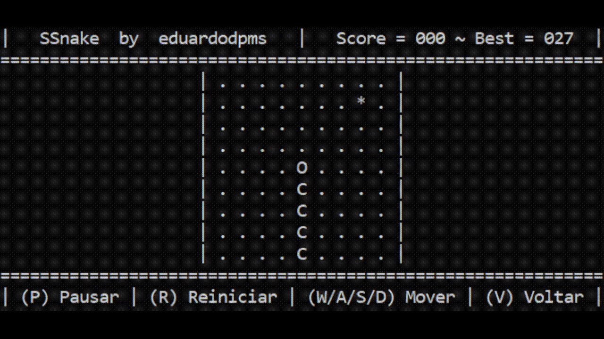

# SSnake 🐍

## 1. Introdução 💡

O *SSnake* é um pequeno jogo desenvolvido unicamente por mim ([*eduardodpms*](https://github.com/eduardodpms)) para testar, praticar e desenvolver as minhas habilidades com a linguagem *C* durante o início da minha graduação em *Engenharia de Software* pela [*UnB*](https://www.unb.br).

Nesse projeto, não me comprometi fielmente com a documentação de requisitos, com o exercício de metodologias de desenvolvimento e nem com o contato com *stakeholders*, uma vez que este não trata-se de um produto.

<br>

## 2. Apresentação 💻

O *SSnake* é um pequeno jogo inspirado no clássico "Jogo da Cobrinha", feito para ser executado inteiramente em terminais do sistema *Windows*. Trata-se de um projeto completo e totalmente funcional, dotado de uma série de funcionalidades implementadas, tais como:

- Navegação completa entre diferentes menus;
- Menu de ajustes, para personalização de uma série de atributos;
- Seleção de diferentes dificuldades e tamanhos de campo;
- Modo de Debug, para testar e acompanhar eventos com precisão;
- Sistema para pausar e reiniciar o jogo.

Abaixo, acompanhe um gif com uma pequena demonstração do jogo em execução, com a *cobra* aumentando de tamanho, atravessando uma parede e, depois, morrendo ao colidir consigo mesma:



<br>

## 3. Requisitos 💼

- Sistema Operacional *Windows*;
- Terminal de Comandos (*CMD* ou *PowerShell*);
- **Opcional**: *GCC* (para compilar o código).

<br>

## 4. Instalação e Uso 🔧

Para executar o jogo ou contribuir com o código, clone o repositório em um diretório de sua preferência:

```bash
git clone https://github.com/eduardodpms/SSnake
```

Depois, navegue até a pasta criada para o repositório:

```bash
cd SSnake
```

---

► Para executar o jogo, basta acessar o executável na pasta `game/`:

```bash
game/ssnake.exe
```

► Se fizer alterações no código, lembre-se de compilar o código antes de rodar o executável:

```bash
gcc -Wall -o game/ssnake.exe   src/game.c src/menus.c src/main.c src/header.h
```

<br>

## 5. Informações Gerais 📄

- Ao executar o código no terminal *PowerShell*, é possível que este apresente instabilitade e não exiba as informações corretamente. Se perceber algum problema, tente reiniciar o terminal;
- Se notar que o terminal não consegue exibir todas as linhas do *output*, tente aumentar o tamanho da janela;
---
- Se encontrar algum problema na execução ou no código, ou tiver alguma sugestão, abra uma ***issue*** no repositório com o máximo de informações a respeito da situação;
- Se tiver interesse em contribuir com o projeto de alguma forma, entre em contato comigo por meio de alguma das vias dispostas no meu *GitHub* pessoal ([*eduardodpms*](https://github.com/eduardodpms)).